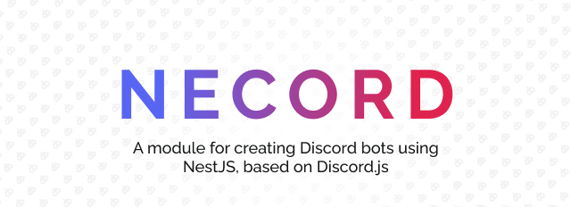

**It’s Finally Here – Welcome to the Necord Blog!**

We’re thrilled to officially announce the launch of the [Necord](https://necord.org) Blog, your go-to destination for everything related to [Necord](https://necord.org), the powerful and flexible [Discord](https://discord.com) bot framework built on top of [NestJS](https://nestjs.com).

Necord grows rapidly thanks to the amazing community, and we want to share our journey with you.

<!-- truncate -->

**What Can You Expect?**
- **Latest Updates** — Stay informed about the latest features, improvements, and releases of Necord.
- **Tutorials** — Dive deep into the world of Necord with our comprehensive tutorials, covering everything from basic setup to advanced features.
- **Best Practices** — Learn about best practices for building and maintaining your Necord bots, ensuring optimal performance and reliability.
- **Community Highlights** — Showcasing the amazing projects, contributions, and stories from the Necord developer community.

We believe that sharing knowledge and engaging with the community is key to building great software.

Thank you to everyone who has supported Necord so far — your feedback, contributions, and enthusiasm have been essential in shaping the project
