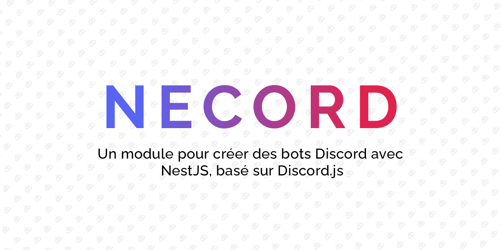

**Ça y est enfin – Bienvenue sur le blog Necord !**

Nous sommes ravis d'annoncer officiellement le lancement du blog [Necord](https://necord.org), votre destination de référence pour tout ce qui concerne [Necord](https://necord.org), le framework de bot [Discord](https://discord.com) puissant et flexible construit sur [NestJS](https://nestjs.com).

Necord connaît une croissance rapide grâce à sa formidable communauté, et nous souhaitons partager notre parcours avec vous.

<!-- truncate -->

**À quoi pouvez-vous vous attendre ?**

- **Dernières nouveautés** — Restez informé des dernières fonctionnalités, améliorations et versions de Necord.
- **Tutoriels** — Plongez au cœur de l'univers de Necord grâce à nos tutoriels complets, qui couvrent tout, de la configuration de base aux fonctionnalités avancées.
- **Bonnes pratiques** — Découvrez les bonnes pratiques pour créer et maintenir vos bots Necord, afin de garantir des performances et une fiabilité optimales.
- **Temps forts de la communauté** — Mise en avant des projets, contributions et histoires extraordinaires de la communauté de développeurs Necord.

Nous sommes convaincus que le partage des connaissances et l'engagement auprès de la communauté sont essentiels pour créer d'excellents logiciels.

Merci à toutes celles et tous ceux qui ont soutenu Necord jusqu'à présent — vos retours, vos contributions et votre enthousiasme ont été essentiels pour façonner le projet
